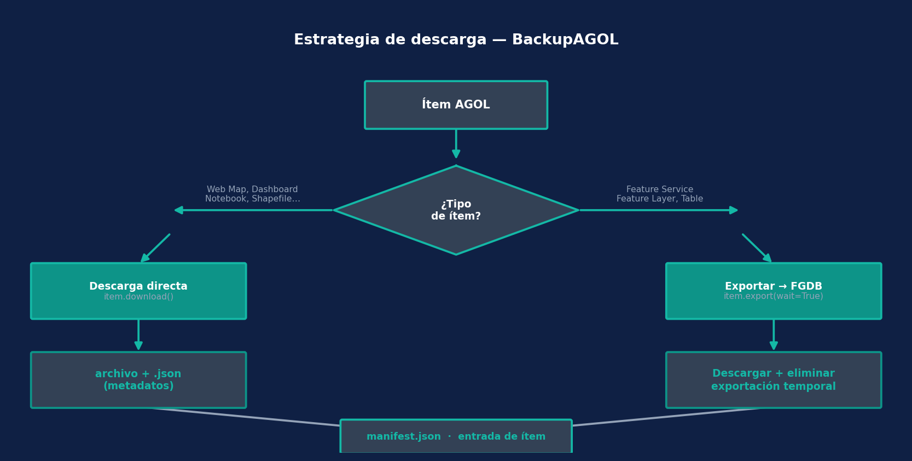

# Backup, eliminación masiva y restauración de contenido ArcGIS Online con Python Toolbox

Cuando una organización migra de una cuenta AGOL a otra, o necesita limpiar años de contenido acumulado sin perder nada, el proceso manual es inviable: entrar ítem por ítem, descargar, eliminar, volver a subir. Con cientos de capas, mapas web y dashboards distribuidos en carpetas, eso puede tomar días.

En este post explico cómo construí un **Python Toolbox** con tres herramientas encadenadas — backup, eliminación masiva y restauración — que automatizan ese ciclo completo usando la **ArcGIS API for Python**.

---

## El problema

La situación que motivó este toolbox: una cuenta AGOL con más de 400 ítems en 12 carpetas que debían migrarse a una cuenta nueva. Los riesgos del proceso manual eran:

- Ítems olvidados o descargados en formato incorrecto
- Eliminaciones accidentales sin respaldo previo
- Pérdida de la estructura de carpetas y los metadatos originales
- Sin trazabilidad de qué se migró y qué no

La solución: automatizar cada etapa y dejar un **manifiesto JSON** como fuente de verdad.

---


*Estrategia de descarga: descarga directa para Web Maps y archivos nativos, exportación a FGDB para Feature Services*

## Arquitectura del toolbox

El `.pyt` expone tres herramientas independientes diseñadas para trabajar en secuencia:

```
BackupAGOL  →  manifest.json  →  DeleteAGOL
                                      ↓
                               RestoreAGOL  →  restore_id_map.json
```

1. **BackupAGOL** — descarga todo el contenido y genera el manifiesto
2. **DeleteAGOL** — lee el manifiesto y elimina los ítems (con protección por ID)
3. **RestoreAGOL** — sube los archivos locales recreando carpetas y metadatos

---

## Tool 1 — BackupAGOL

La herramienta distingue dos estrategias de descarga según el tipo de ítem:

- **Descarga directa**: Web Maps, Notebooks, Dashboards, Shapefiles, PDFs y otros formatos que AGOL entrega como archivo nativo.
- **Exportación**: Feature Services y Feature Layers se exportan a File Geodatabase antes de descargar, ya que no tienen un archivo local equivalente.

```python
EXPORT_FORMATS = {
    "Feature Service":    "File Geodatabase",
    "Feature Layer":      "File Geodatabase",
    "Table":              "File Geodatabase",
    "Feature Collection": "GeoJSON",
}

def _backup_item(self, item, folder_name, output_dir, dry_run, export_feats):
    dest_dir = output_dir / (folder_name.lstrip("/") or "root")
    dest_dir.mkdir(parents=True, exist_ok=True)

    # Metadatos JSON siempre, independiente del tipo
    meta = {
        "id": item.id, "title": item.title, "type": item.type,
        "tags": item.tags, "access": item.access,
        "dependencies": self._extract_dependencies(item),
    }
    (dest_dir / f"{self._safe(item.title)}_{item.id}.json").write_text(
        json.dumps(meta, ensure_ascii=False, indent=2), encoding="utf-8"
    )

    if item.type in DIRECT_DOWNLOAD_TYPES:
        if self._direct_download(item, dest_dir, dry_run):
            return "success"

    if export_feats and item.type in EXPORT_FORMATS:
        if self._export_item(item, dest_dir, dry_run):
            return "exported"

    return "skipped"
```

Un detalle importante: la exportación crea un ítem temporal en AGOL con nombre `_bk_<id>_<timestamp>`, lo descarga y luego lo **elimina automáticamente** para no contaminar la cuenta con exportaciones huérfanas.

```python
def _export_item(self, item, dest_dir, dry_run):
    fmt = EXPORT_FORMATS.get(item.type, "File Geodatabase")
    export_title = f"_bk_{item.id}_{int(time.time())}"
    exported = item.export(title=export_title, export_format=fmt, wait=True)
    if exported:
        exported.download(save_path=str(dest_dir))
        exported.delete()   # limpieza automática
        return True
```

### El manifiesto

Al terminar el backup se genera `manifest.json` con la estructura completa de la cuenta: carpetas, ítems, tipos, accesos y dependencias entre Web Maps y sus capas operacionales.

```json
{
  "tool": "AGOLBackupDeleteToolbox",
  "generated": "2026-04-08T10:30:00",
  "portal": "https://www.arcgis.com",
  "user": "mi_usuario",
  "folders": {
    "/": [
      {
        "id": "abc123",
        "title": "Mapa predios",
        "type": "Web Map",
        "access": "org",
        "dependencies": [{ "itemId": "xyz789", "title": "Predios Feature Layer" }]
      }
    ],
    "Operaciones": [
      { "id": "def456", "title": "Capa vías", "type": "Feature Service", "access": "private" }
    ]
  }
}
```

---

## Tool 2 — DeleteAGOL

La eliminación masiva lee el manifiesto y procesa cada ítem. Por diseño, el **dry-run está activo por defecto** y exige marcar una casilla de confirmación explícita antes de eliminar en real — una salvaguarda importante cuando se opera sobre cientos de ítems.

```python
def updateMessages(self, params):
    dry_run   = params[5].value
    confirmed = params[6].value
    if not dry_run and not confirmed:
        params[6].setErrorMessage(
            "Debes marcar la casilla de confirmación para eliminar ítems."
        )
```

El flujo por ítem intenta primero desproteger el ítem (algunos tienen protección activa en AGOL) y luego lo elimina:

```python
def _delete_item(self, gis, item_id, item_title, dry_run):
    item = gis.content.get(item_id)
    if not item:
        return "not_found"

    try:
        item.protect(enable=False)   # desactiva protección si existe
    except Exception:
        pass

    result = item.delete()
    return "deleted" if result else "failed"
```

Los ítems que fallen se guardan en `delete_failed.json` para revisión manual. También se puede definir una lista de **IDs protegidos** en la interfaz, que el toolbox respetará sin tocar.

---

## Tool 3 — RestoreAGOL

La restauración recorre el manifiesto, recrea las carpetas en la cuenta destino y sube cada archivo local con sus metadatos originales (título, tags, snippet, tipo).

El paso más delicado es encontrar el archivo correcto para cada ítem, ya que los nombres en disco pueden diferir del título original. La herramienta implementa **cuatro niveles de coincidencia** en orden de prioridad:

```python
def _find_local_file(self, local_dir, item_id, item_title, valid_exts):
    files = [f for f in local_dir.iterdir()
             if f.is_file() and f.suffix.lower() in valid_exts]

    # Nivel 1: item_id aparece en el nombre del archivo
    for f in files:
        if item_id in f.name:
            return f

    # Nivel 2: nombre del archivo == título normalizado
    safe_title = "".join(
        c if c.isalnum() or c in "_-" else "_" for c in item_title.lower()
    )
    for f in files:
        stem_clean = f.stem.lower().replace(".gdb", "").replace(".shp", "")
        if stem_clean == safe_title:
            return f

    # Nivel 3: título normalizado contenido en el nombre del archivo
    for f in files:
        if len(safe_title) > 5 and safe_title in f.name.lower():
            return f

    # Nivel 4: único archivo candidato en la carpeta
    if len(files) == 1:
        return files[0]

    return None
```

Una vez subidos todos los ítems, se genera `restore_id_map.json` con la correspondencia entre los IDs originales y los nuevos. Esto es clave para los **Web Maps**: sus referencias internas apuntan a los IDs viejos de las capas, que en la cuenta destino son distintos.

```json
{
  "abc123": "new_id_001",
  "def456": "new_id_002"
}
```

---

## Modo simulación (Dry-Run)

Las tres herramientas incluyen dry-run: ejecutan toda la lógica de inventario, conexión y coincidencia de archivos, pero **sin hacer ninguna operación destructiva ni de escritura**. Permite verificar qué se descargaría, eliminaría o subiría antes de comprometer créditos o cambios reales.

---

## Consideraciones de créditos

La exportación de Feature Services consume créditos AGOL (~1 crédito por cada 1.000 entidades exportadas). El parámetro `export_features` permite desactivarlo y hacer backup solo de metadatos para capas grandes, reduciendo el costo del proceso.

---

## Resultados

Con este toolbox, una migración que habría tomado varios días de trabajo manual se reduce a tres ejecuciones secuenciales en ArcGIS Pro. El manifiesto JSON actúa como auditoría completa: queda registro de qué había, en qué carpeta estaba y qué se migró.

---

## Próximos pasos

- Re-mapeo automático de dependencias en Web Maps usando `restore_id_map.json`
- Soporte para ítems con datos relacionados (Related Tables, Attachments)
- Filtro de backup por fecha de modificación (solo ítems actualizados desde X fecha)
- Exportación a GeoPackage o CSV para reducir créditos en capas grandes

---

*¿Tienes preguntas o mejoras? Escríbeme a [faneal14@gmail.com](mailto:faneal14@gmail.com) o en [LinkedIn](https://linkedin.com/in/faneal).*
